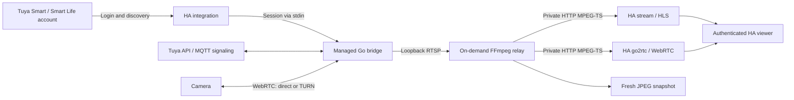

# How it works

The user configures an account in Home Assistant. The integration discovers
camera devices and manages a Go bridge; viewers use native HA camera entities.

## Media and processes

The bridge handles the Tuya mobile protocol and presents RTSP on automatically
allocated loopback ports. A relay starts when media is requested. H.264 video
is copied; HEVC is decoded and encoded to H.264 at 720p / 15 fps for playback.
Receive audio is converted to AAC for the HTTP relay and Opus through the native
HA WebRTC provider. The tested HEVC camera supplies 16-bit PCM audio; the bridge
converts its sample byte order and preserves RTP sampling timestamps.

HA's built-in `stream`, FFmpeg integration and go2rtc provider serve the frontend.
No separate ONVIF service, MediaMTX installation or user-managed RTSP port is
required. This is a native custom integration with supervised subprocesses; the
Go executable is installed automatically for Linux amd64/AArch64.

## Lifecycle

Each account entry owns its bridge and camera relays. Shutdown, unload and removal
stop owned processes. Crash recovery restarts the bridge with bounded retry
delays; an expired session requests UI reauthentication. Camera availability and
last-video activity help distinguish a connected process from fresh media.
Snapshots request current video rather than returning an indefinitely cached JPEG.

## Network and trust

Tuya authentication, discovery and signaling need internet access. Media can use
a direct WebRTC path or a TURN relay depending on the camera and network. This
project has not established fully offline operation.

The password is transient; HA stores session data in its config entry. Session
material reaches the bridge through stdin. Release executables are versioned,
SHA-256 verified and installed atomically. Managed listeners bind to loopback;
relay paths are random. HA authenticates access to its camera frontend.

The subprocesses share the HA container's permissions. Loopback listeners are
not isolation from other processes in that container. Treat HA backups as
sensitive and see [SECURITY.md](../SECURITY.md).

The [standalone add-on](../tuya-camera-bridge-addon/DOCS.md) remains a separate
compatibility path with different network exposure and manual configuration.
